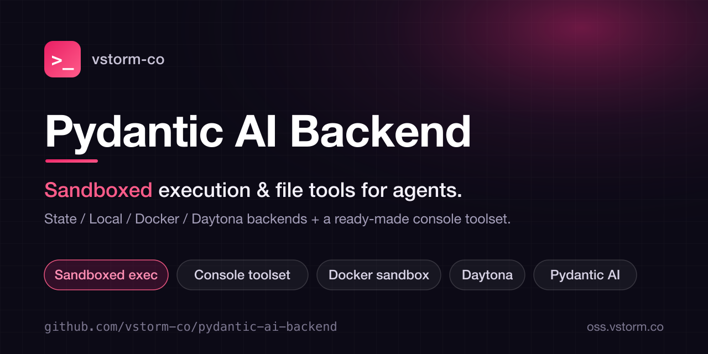

<p align="center">
  
</p>

<h1 align="center">Pydantic AI Backend</h1>

<p align="center"><em>Sandboxed execution & file tools for agents.</em></p>

<p align="center">
  <a href="https://pypi.org/project/pydantic-ai-backend/"></a>
  <a href="https://pepy.tech/projects/pydantic-ai-backend"></a>
  <a href="https://github.com/vstorm-co/pydantic-ai-backend/stargazers"></a>
  <a href="https://www.python.org/downloads/"></a>
  <a href="https://opensource.org/licenses/MIT"></a>
  <a href="https://coveralls.io/github/vstorm-co/pydantic-ai-backend?branch=main"></a>
  <a href="https://github.com/vstorm-co/pydantic-ai-backend/actions/workflows/ci.yml"></a>
  <a href="https://github.com/pydantic/pydantic-ai"></a>
</p>

---

!!! tip "Part of Pydantic Deep Agents"
    **Pydantic AI Backend** is one library in [Pydantic Deep Agents](https://github.com/vstorm-co/pydantic-deepagents) — the open-source
    Claude Code alternative & Python agent framework. Use it standalone, or get every
    library wired together in a single `create_deep_agent()` call.

**pydantic-ai-backend** provides file storage, sandbox execution, and a ready-to-use console toolset for [pydantic-ai](https://ai.pydantic.dev/) agents. Give your AI agents the ability to read, write, and execute code safely.

<div class="grid cards" markdown>

- :material-console: **Console Toolset**

    Ready-to-use tools: ls, read, write, edit, glob, grep, execute

- :material-docker: **Docker Isolation**

    Execute code safely in isolated containers

- :material-folder-multiple: **Multiple Backends**

    In-memory, filesystem, Docker — same interface

- :material-shield-lock: **Permission System**

    Fine-grained access control with presets

</div>

## Quick Start (Capability API)

The recommended way to add filesystem tools:

```python
from pydantic_ai import Agent
from pydantic_ai_backends import ConsoleCapability

agent = Agent("openai:gpt-4.1", capabilities=[ConsoleCapability()])
```

### With Permissions

```python
from pydantic_ai_backends import ConsoleCapability
from pydantic_ai_backends.permissions import READONLY_RULESET

# Read-only agent — write/edit/execute tools hidden from model
agent = Agent("openai:gpt-4.1", capabilities=[
    ConsoleCapability(permissions=READONLY_RULESET),
])
```

### Alternative: Toolset API

```python
from dataclasses import dataclass
from pydantic_ai import Agent
from pydantic_ai_backends import LocalBackend, create_console_toolset

@dataclass
class Deps:
    backend: LocalBackend

agent = Agent("openai:gpt-4.1", deps_type=Deps, toolsets=[create_console_toolset()])
```

## Choose Your Backend

Same toolset, different backends — swap based on your use case:

=== "Local Development"

    ```python
    from pydantic_ai_backends import LocalBackend

    backend = LocalBackend(root_dir="./workspace")
    ```

=== "Testing"

    ```python
    from pydantic_ai_backends import StateBackend

    backend = StateBackend()  # In-memory, no side effects
    ```

=== "Production (Docker)"

    ```python
    from pydantic_ai_backends import DockerSandbox

    backend = DockerSandbox(runtime="python-datascience")
    ```

=== "Multi-User"

    ```python
    from pydantic_ai_backends import SessionManager

    manager = SessionManager(workspace_root="/app/workspaces")
    backend = await manager.get_or_create("alice")
    ```

## Available Tools

| Tool | Description |
|------|-------------|
| `ls` | List files in a directory |
| `read_file` | Read file content with line numbers |
| `write_file` | Create or overwrite a file |
| `edit_file` | Replace strings in a file |
| `glob` | Find files matching a pattern |
| `grep` | Search for patterns in files |
| `execute` | Run shell commands (optional) |

## Backend Comparison

| Backend | Persistence | Execution | Best For |
|---------|-------------|-----------|----------|
| `LocalBackend` | Persistent | Yes | CLI tools, local dev |
| `StateBackend` | Ephemeral | No | Testing, mocking |
| `DockerSandbox` | Ephemeral* | Yes | Safe execution, multi-user |
| `DaytonaSandbox` | Ephemeral | Yes | Cloud deployments, CI/CD, multi-user |
| `CompositeBackend` | Mixed | Depends | Route by path prefix |

*[`DockerSandbox`][pydantic_ai_backends.backends.docker.sandbox.DockerSandbox]
supports persistent storage by mounting host directories with its `volumes`
parameter (and `container_name` to reuse a named container across restarts).
The [`SessionManager`][pydantic_ai_backends.backends.docker.session.SessionManager] `workspace_root`
parameter builds these volume mounts automatically, one per session.

## Related Projects

| Package | Description |
|---------|-------------|
| [Pydantic Deep Agents](https://github.com/vstorm-co/pydantic-deepagents) | Full agent framework (uses this library) |
| [pydantic-ai-todo](https://github.com/vstorm-co/pydantic-ai-todo) | Task planning toolset |
| [subagents-pydantic-ai](https://github.com/vstorm-co/subagents-pydantic-ai) | Multi-agent orchestration |
| [summarization-pydantic-ai](https://github.com/vstorm-co/summarization-pydantic-ai) | Context management |
| [pydantic-ai](https://github.com/pydantic/pydantic-ai) | The foundation — agent framework by Pydantic |

## Next Steps

<div class="grid cards" markdown>

- :material-download: **[Installation](installation.md)**

    Get started with pip or uv

- :material-book-open-variant: **[Concepts](concepts/index.md)**

    Learn about backends and toolsets

- :material-code-tags: **[Examples](examples/index.md)**

    See real-world usage patterns

- :material-api: **[API Reference](api/index.md)**

    Full API documentation

</div>
