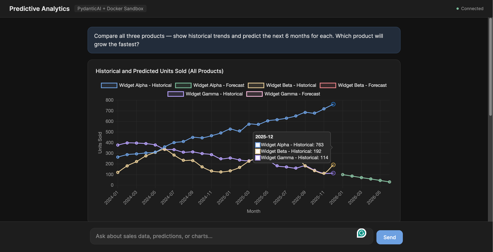
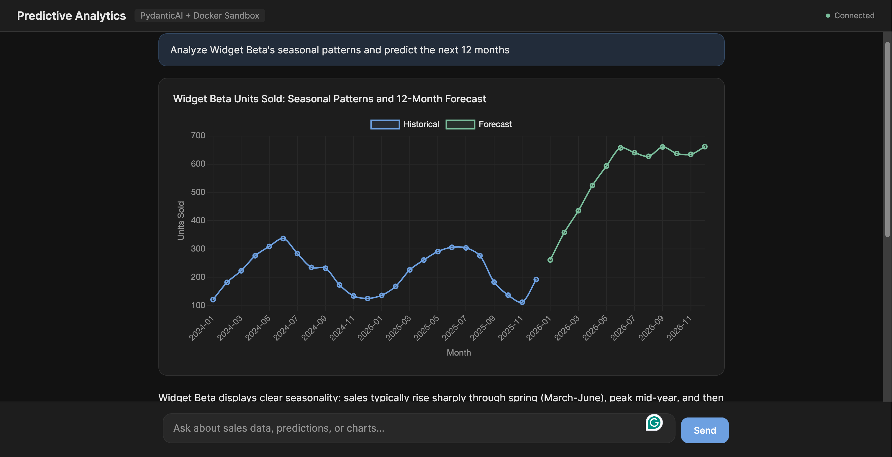

# Predictive Analytics Demo

PydanticAI agent with Docker sandbox for data science predictions.



## What it does

A chat-based analytics assistant that can:

1. **Query data** — filter and aggregate monthly sales data (3 products, 3 regions, 24 months)
2. **Run predictions** — a sub-agent writes and executes Python (sklearn, pandas, numpy) inside an isolated Docker container
3. **Generate charts** — structured Pydantic output rendered as Chart.js line charts in the browser



## Architecture


```
Browser (HTML/JS + Chart.js)
    | WebSocket
FastAPI Server
    |
PydanticAI Agent
    ├── query_data      → reads sales_data.json
    ├── predict          → sub-agent + DockerSandbox
    └── generate_chart   → LineChartData → Chart.js
```

The `predict` tool demonstrates **"environment as a tool"** — the main agent delegates to a sub-agent that has full access to a Docker container with data science libraries. The sub-agent writes Python scripts, executes them, and returns results.

This is a key design choice: the Docker sandbox is exposed **as a tool** (not as the agent's default environment). The main agent decides *when* to use the sandbox based on the user's request. This gives the agent flexibility — it can answer simple queries directly, and only spin up code execution when predictions or complex analysis are needed.

## Requirements

- Docker running locally
- OpenAI API key

## Setup

```bash
pip install -r requirements.txt
```

## Run

```bash
export OPENAI_API_KEY=your-key-here
uvicorn examples.predictive_analytics.server:app --host 0.0.0.0 --port 8000
```

Open [http://localhost:8000](http://localhost:8000)

First startup pulls `python:3.12-slim` and installs data science packages (pandas, numpy, sklearn) — takes ~30-60 seconds. Subsequent starts reuse the running container.

## Try these prompts

- "Show me monthly sales trends for all products"
- "Analyze Widget Beta's seasonal patterns and predict the next 12 months"
- "Compare all three products — show historical trends and predict the next 6 months for each"
- "Which product has the strongest growth trend?"

## Key files

| File | Purpose |
|------|---------|
| `agent.py` | PydanticAI agent + 3 tools (query_data, predict, generate_chart) |
| `server.py` | FastAPI + WebSocket streaming |
| `models.py` | Pydantic models (LineChartData, AnalyticsDeps) |
| `data/sales_data.json` | Sample dataset (216 records) |
| `static/` | Frontend (HTML + CSS + JS + Chart.js) |

## How the predict tool works

1. Main agent calls `predict("Predict Widget Alpha sales for 6 months")`
2. Sales data is written into the Docker container at `/workspace/sales_data.json`
3. A sub-agent (PydanticAI) is created with `create_console_toolset()` (read, write, execute)
4. Sub-agent writes a Python script using pandas/sklearn
5. Sub-agent executes the script in Docker
6. Results flow back to the main agent

## Environment as a tool vs. default environment

This demo uses Docker sandbox **as a tool** — the agent chooses when to invoke it. An alternative approach is giving the agent a Docker environment as its **default runtime** (like Claude Code or a coding agent). The trade-offs:

| | Environment as Tool | Default Environment |
|---|---|---|
| **When to use** | Specific tasks (predictions, data analysis) | General-purpose coding agents |
| **Agent control** | Agent decides when to use sandbox | Agent always runs in sandbox |
| **Overhead** | Only pays Docker cost when needed | Always running |
| **Safety** | Isolated per-tool-call | Full session isolation |
| **Flexibility** | Can mix tools (query locally + predict in Docker) | Everything runs in one place |

For this demo, "environment as a tool" is the right choice — the agent mostly answers questions and only needs Docker for running sklearn/pandas predictions.
